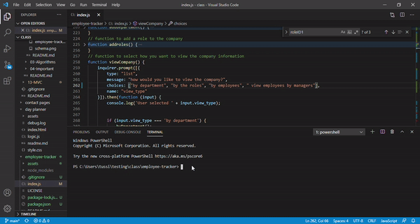

# employee-tracker
 
  ## Description
  This project focuses on the use of connectiong Node to an SQL. With the use of this project, an individual can add, update, view, and delete employees from the company records with easy.
  
  ## Table of Contents
  - [Title](#Title)
  - [Description](#description)
  - [Table of Contents](#table-of-contents)
  - [Screenshots](#screenshots)
  - [Installation](#installation)
  - [Usage](#usage)
  - [Testing](#testing)
  - [Additional Information](#additional-information)
  - [License](#license)
  - [Contributing](#contributing)
  - [Questions and Feedback](#questions-and-feedback)

  ## Installation
   To use this program, simply clone the repository, open in the command terminal, run npm i to download the modules, use the shcema.sql file to create your database, set the sql password to your personal password, and run node index.js

  ## Usage
  This project can be used to monitor company employment records and edit them as needed.

  ## Technologies Used:
  Javascript, Node, and SQL

  ## Code Sample
  As it shows in the sample code, with connection.query you can call the SQL for information stored there.
  

  ## Screenshots
  

  ## License
  MIT License - see the [LICENSE.txt](https://github.com/tussingj89/Employee-Tracker/blob/main/LICENSE.txt) file for details
  
  ## Testing 
  There is currently no test available for this program.

  ## Contributing
  When contributing to this repository, please first discuss the change you wish to make via issue, email, or any other method with the owners of this repository before making a change.
  
  ## Questions and Feedback
  Please contact me using one of the following:
  - Github: [tussingj89](https://gist.github.com/tussingj89)
  - Email: tussing40@gmail.com
